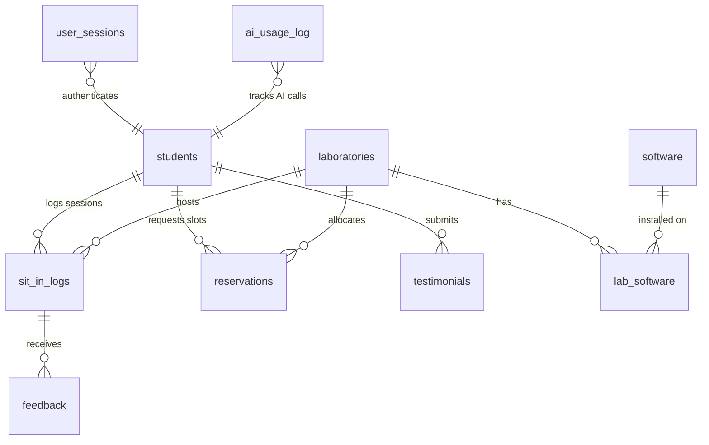

# CCS Sit-In Monitoring System — Backend Reference Manual

This document serves as the absolute technical reference for the CCS Sit-In Monitoring System backend. It covers the core system architecture, directory topology, relational database schema, model layer (DAOs), functional API endpoints, security mechanisms, and the advanced AI telemetry/security layer.

---

## 1. System Overview & Architecture

The backend of the CCS Sit-In Monitoring System is engineered as a **Pure PHP (stateless)** API. It deliberately avoids heavyweight frameworks to maintain optimal performance, low latency, and full control over database interactions.

### Architectural Patterns
*   **Procedural-OO Hybrid Routing:** Core infrastructure and routing are file-system based. HTTP requests map directly to individual script files in the `api/` directory (serving as Controllers).
*   **Data Access Object (DAO) / Active Record Pattern:** All business logic, transaction boundaries, and SQL operations reside inside dedicated classes in the `src/models/` folder. Controllers instantiate these models and delegate operations.
*   **Bootstrap & Dependency Injection:** `includes/initialize.php` initializes paths, loads the environment (`.env`), instantiates the PDO database connection (`includes/config.php`), and autoloads/includes all core models.
*   **Middleware-like Guards:** Stateless authentication and operational limits are enforced at the very top of endpoints using utility-based guard methods (`requireAuth()`, `requireAdmin()`, and `AiAuthMiddleware::guard()`).

```
           [Client / Frontend App]
                      |  (HTTP Requests with JWT & HMAC)
                      v
             [API Endpoint Script]  <--- [includes/initialize.php]
             (Skinny Controller)            | Loads environment & database
                      |                     | Enforces CORS / JSON Headers
                      +-------------------->+ Enforces Auth Middleware
                      |                     | (`requireAuth` / `requireAdmin`)
                      v
             [Model Class (DAO)]    <--- [includes/validator.php]
             (Fat Model, PDO Bound)         | Centralized sanitization
                      |
                      v
             [PostgreSQL Database]
```

---

## 2. Database Schema & Relational Mapping

The database is built on **PostgreSQL 14+** using strict schema definitions, foreign key constraints, default constraints, and optimized index structures. All tables use UUIDs (via `uuid-ossp`) for primary identifiers, ensuring high collision resistance and secure non-sequential keys.



### Table Dictionary

#### 1. `students`
Tracks student identity, courses, semesters, and remaining sit-in session balances.
*   `id` (UUID, PK): `DEFAULT uuid_generate_v4()`
*   `student_id` (VARCHAR(50), UNIQUE, NOT NULL): 8-digit unique identifier (e.g. `20241028`)
*   `first_name` (VARCHAR(100), NOT NULL)
*   `last_name` (VARCHAR(100), NOT NULL)
*   `middle_name` (VARCHAR(100), NULL)
*   `course` (VARCHAR(100), NULL)
*   `course_level` (VARCHAR(50), NULL)
*   `email` (VARCHAR(100), UNIQUE, NOT NULL)
*   `password` (VARCHAR(255), NOT NULL): Bcrypt hashed string
*   `is_active` (BOOLEAN): `DEFAULT TRUE`
*   `session` (INTEGER): Remaining credits, `DEFAULT 30`
*   `profile_pic` (VARCHAR(255), NULL): Relative path to avatar file
*   `created_at` / `updated_at` (TIMESTAMP): `DEFAULT CURRENT_TIMESTAMP`
*   `deleted_at` (TIMESTAMP, NULL): Soft-deletion column

#### 2. `sit_in_logs`
Represents an atomic laboratory workspace usage session.
*   `id` (UUID, PK): `DEFAULT uuid_generate_v4()`
*   `student_id` (VARCHAR(50), FK): References `students(student_id)`
*   `lab_id` (INTEGER, FK): References `laboratories(id) ON DELETE SET NULL`
*   `pc_number` (INTEGER, NULL)
*   `purpose` (VARCHAR(255))
*   `time_in` (TIMESTAMP): `DEFAULT CURRENT_TIMESTAMP`
*   `time_out` (TIMESTAMP, NULL)
*   `status` (VARCHAR(20)): `ongoing` or `completed`
*   `reservation_id` (INTEGER, NULL): Refers to the originating reservation (if any)
*   `created_at` / `updated_at` (TIMESTAMP)
*   `deleted_at` (TIMESTAMP, NULL)

#### 3. `reservations`
Manages scheduled student bookings.
*   `id` (UUID or SERIAL, PK)
*   `student_id` (VARCHAR(50), FK): References `students(student_id)`
*   `lab_id` (INTEGER, FK): References `laboratories(id)`
*   `pc_number` (INTEGER)
*   `reserved_date` (DATE)
*   `reserved_time` (TIME or VARCHAR(50))
*   `status` (VARCHAR(50)): `pending`, `approved`, `rejected`, `rescheduled`, `cancelled`, `fulfilled`
*   `purpose` (VARCHAR(255))
*   `admin_note` (TEXT, NULL)

#### 4. `laboratories`
*   `id` (SERIAL, PK)
*   `name` (VARCHAR(100), NOT NULL)
*   `lab_code` (VARCHAR(50), UNIQUE)
*   `capacity` (INTEGER, `DEFAULT 30`)
*   `is_active` (BOOLEAN, `DEFAULT TRUE`)
*   `image_path` (VARCHAR(255), NULL)

#### 5. `courses`
*   `id` (SERIAL, PK)
*   `code` (VARCHAR(50), UNIQUE, NOT NULL): e.g. `BSIT`, `BSCS`
*   `name` (VARCHAR(255), NOT NULL)

#### 6. AI Security & Telemetry Tables
*   **`user_sessions`**: Tracks active stateless sessions, device fingerprint hashes, and IP telemetry to prevent session hijacking.
    *   `id` (SERIAL, PK)
    *   `user_id` (INTEGER / UUID String, NOT NULL)
    *   `role` (VARCHAR(20), NOT NULL CHECK (`student` / `admin`))
    *   `token_hash` (VARCHAR(64), UNIQUE): SHA-256 hash of the issued JWT token.
    *   `device_fingerprint` (VARCHAR(255)): SHA-256 hash of User-Agent + Accept-Language
    *   `ip_address` (INET)
    *   `created_at` / `expires_at` / `last_used_at` (TIMESTAMP)
    *   `is_active` (BOOLEAN, `DEFAULT TRUE`)
*   **`ai_usage_log`**: Detailed tracking of AI calls, tokens used, and security blocks.
    *   `id` (SERIAL, PK)
    *   `user_id` (VARCHAR(50), NOT NULL)
    *   `role` (VARCHAR(20), NOT NULL)
    *   `endpoint` (VARCHAR(50), NOT NULL)
    *   `tokens_used` (INTEGER, NULL)
    *   `requested_at` (TIMESTAMP)
    *   `was_blocked` (BOOLEAN)
    *   `block_reason` (VARCHAR(50)): e.g. `cooldown`, `prompt_injection`, `daily_quota`
*   **`ai_abuse_log`**: Hard block list for excessive security failures or prompt injection offenders.
    *   `id` (SERIAL, PK)
    *   `identifier` (VARCHAR(255), NOT NULL): IP or student ID
    *   `failure_type` (VARCHAR(30)): e.g. `prompt_injection`, `invalid_token`, `invalid_signature`
    *   `ip_address` (INET)
    *   `attempted_at` (TIMESTAMP)
*   **`ai_global_budget`**: Enforces strict operational cost control limits on the system.
    *   `budget_date` (DATE, UNIQUE, DEFAULT CURRENT_DATE)
    *   `chat_calls` (INTEGER, `DEFAULT 0`)
    *   `analysis_calls` (INTEGER, `DEFAULT 0`)
    *   `summary_calls` (INTEGER, `DEFAULT 0`)

---

## 3. Core Models & Data Access Objects (DAOs)

Every model file is located in `src/models/`, accepts the PDO connection in its constructor, and sanitizes input variables prior to database execution.

### `Student`
Encapsulates all logic for student registration, profiles, credentials, and session balance.
*   **Key Methods:**
    *   `login()`: Retrieves the credentials matching `student_id`. Returns database record or `false`.
    *   `create()`: Creates a new student profile in `students`. Returns insert status.
    *   `studentIdExist($id)` / `emailExist()`: Checks uniqueness constraints.
    *   `getDetailsByStudentId($studentId)`: Aggregates student profile info, lifetime metrics, completed session arrays, and upcoming reservation slots in a single response payload.

### `SitIn`
Handles session lifecycle ("Time-In" and "Time-Out") and capacity checks.
*   **Key Methods:**
    *   `timeIn($studentId, $labId, $purpose, $pcNumber)`: Atomically logs a new laboratory entry with status `ongoing`.
    *   `timeOut($logId)`: Ends the session, marks status `completed`, sets `time_out = CURRENT_TIMESTAMP`, and triggers a deduct credit query on `students`.
    *   `isPcInUse($labId, $pcNumber)`: Enforces that no two ongoing sit-ins occupy the same workstation concurrently.

### `Reservation`
Coordinates booking pipelines and conflict resolutions.
*   **Key Methods:**
    *   `convertToSitIn($reservationId)`: Fulfils a reservation by checking if:
        1.  The reservation is already `approved`.
        2.  The student has `session > 0` remaining credits.
        3.  The student does not have any active ongoing sit-ins.
        It then triggers an atomic insert into `sit_in_logs` and flags the reservation as `fulfilled` within a database transaction context.
    *   `isPcReservedNow($labId, $pcNumber)`: Evaluates if a workstation is reserved for a future slot (window check).

### `Dashboard`
Aggregates key operations metrics for administrators.
*   **Key Methods:**
    *   `getStats()`: Direct read queries returning registered students count, ongoing sit-ins count, lab usage frequency, average study duration, and top 5 purpose distributions.
    *   `getSessionsByPurpose($from, $to)` / `getSessionsByLab($from, $to)` / `getDailyTrend($days)`: Provides time-sliced analytical data for reporting.

### `PC`
Manages granular physical machine statuses inside laboratories.
*   **Key Methods:**
    *   `updateStatus($id, $status)`: Updates both `pc_status` (e.g. `active`, `disabled`) and `reservation_status`. Disabling a PC automatically flags `reservation_status` as `unavailable` to prevent slot bookings.
    *   `upsert($labId, $pcNumber, $pcStatus, $resStatus)`: Secure bulk/single configuration wrapper.

### `SoftwareRequest`
Coordinates software installation requests submitted by students.
*   **Key Methods:**
    *   `create($student_id, $software_name, $reason, $lab_id)`: Submits a new entry.
    *   `updateStatus($id, $status)` / `bulkUpdateStatus($ids, $status)`: Admin approval pipeline.

---

## 4. API Endpoints Reference

All endpoint files reside inside the `api/` directory.

### Authentication (`api/auth/`)

#### 1. `POST /api/auth/login.php`
*   **Request Headers:** `Content-Type: application/json`
*   **Payload Schema:**
    ```json
    {
      "student_id": "20241028",
      "password": "my_secure_password"
    }
    ```
*   **Workflow:**
    1. Compares credentials against Admin ENV values (`ADMIN_USERNAME` / `ADMIN_PASSWORD`). If matched, issues an Admin JWT with a 10-hour lifetime.
    2. Otherwise, invokes `Student::login()` and verifies the Bcrypt password hash. If verified, issues a Student JWT with a 1-hour lifetime.
    3. Hashes the JWT with SHA-256 and inserts a session tracking row into `user_sessions`.
*   **Success Response (200 OK):**
    ```json
    {
      "success": true,
      "message": "Login successful.",
      "token": "eyJhbGciOi...",
      "user": {
        "role": "student",
        "student_id": "20241028",
        "first_name": "Juan",
        "last_name": "Cruz",
        "session": 30
      }
    }
    ```

#### 2. `POST /api/auth/register.php`
*   **Payload Schema:**
    ```json
    {
      "student_id": "20241028",
      "first_name": "Juan",
      "last_name": "Cruz",
      "middle_name": "Santos",
      "email": "juan.cruz@university.edu",
      "course": "BSIT",
      "course_level": "3rd Year",
      "password": "securepassword",
      "address": "Manila, Philippines"
    }
    ```
*   **Success Response (210 Created):**
    ```json
    {
      "success": true,
      "message": "Student registered successfully!",
      "data": { "id": "uuid-string-here" }
    }
    ```

### AI Analytics & Insights (`api/ai/`)

#### 1. `POST /api/ai/chat.php`
*   **Request Headers:**
    *   `Authorization: Bearer <JWT_TOKEN>`
    *   `X-AI-Signature: <HMAC_SHA256_SIGNATURE>`
    *   `X-AI-Timestamp: <UNIX_TIMESTAMP>`
*   **Payload Schema:**
    ```json
    {
      "messages": [
        {"role": "user", "content": "How many sit-in credits do I have left?"}
      ]
    }
    ```
*   **Authorization Guard:** `AiAuthMiddleware::guard('chat', $db, $input)` (Enforces JWT, signature, IP/Fingerprint, global budget limits, student cooldown, burst limits, and daily quotas).
*   **Security Check:** Runs regex-based prompt injection detection. Blocked queries return 429 and register blocks.
*   **Fallback Logic:** When `AI_ENABLED = false` in `config/ai.php`, it returns a sandbox mock response.
*   **Success Response (200 OK):**
    ```json
    {
      "success": true,
      "message": "AI reply retrieved successfully",
      "reply": "You have 28 sit-in credits remaining out of your 30 seasonal credits."
    }
    ```

#### 2. `POST /api/ai/student_insights.php`
*   **Request Headers:** Standard Auth + AI Telemetry Headers
*   **Workflow:** Invokes Gemini 2.5 Flash to generate analytical study insights based on student laboratory logs, recent history, and upcoming reservations. If Gemini is rate-limited (HTTP 429), it automatically triggers a fallback loop using Groq (Llama-3).
*   **Success Response (200 OK):**
    ```json
    {
      "success": true,
      "message": "AI student insights retrieved successfully",
      "summary": "You have completed 8 sit-in sessions totaling 12 hours. You maintain steady afternoon habits, mostly using Lab 3.",
      "cards": [
        {"title": "Weekly Trend", "description": "PEak afternoon slot", "type": "stat", "value": "+15%"},
        {"title": "Off-Peak Hours", "description": "Lab 5 has 40% lower traffic at 1 PM.", "type": "idea", "value": "Tip"},
        {"title": "Credits Warning", "description": "You have 28 credits remaining.", "type": "warning", "value": "28 Left"}
      ]
    }
    ```

#### 3. `POST /api/ai/admin_insights.php`
*   **Request Headers:** Admin Auth + AI Telemetry Headers
*   **Workflow:** Summarizes lab capacities, historical seat occupancy patterns, week-over-week traffic trends, and pending reservation counts. Outputs 4 advanced strategic suggestions for resource scheduling.
*   **Success Response (200 OK):** Returns exactly 4 strategic cards grouped under `utilization`, `recommendation`, `alert`, and `trend`.

#### 4. `POST /api/ai/booking_recommendations.php`
*   **Workflow:** Identifies 3 historical low-occupancy timeslots and laboratories suitable for students based on 30-day seat volumes.
*   **Success Response (200 OK):** Returns recommended slots and general trend advices.

---

## 5. Security & Integrity Protocols

The backend enforces defense-in-depth across multiple layers:

### Stateless Session & JWT Verification
Authorization is stateless. Tokens are passed in the `Authorization: Bearer <token>` header.
1.  **Extraction:** Endpoints run `requireAuth()` or `requireAdmin()`.
2.  **Signature Verification:** Tokens are verified using `Firebase\JWT\JWT::decode` with a secure key stored in `$_ENV['JWT_SECRET']`.
3.  **Active Session DB Verification:** The SHA-256 hash of the raw token is searched against `user_sessions`. If `is_active = false`, or the token has expired, or a token mismatch is found, it is rejected.
4.  **IP Fingerprint Telemetry:** The server recalculates a client fingerprint matching the device SHA-256:
    $$\text{Fingerprint} = \text{SHA256}(\text{UserAgent} \mathbin{\Vert} \text{AcceptLanguage})$$
    A deviation logs an alert immediately to guard against session-hijacking.

### HMAC Request Signing
AI endpoints require cryptographic verification to prevent HTTP payload tampering:
1.  **Signature Calculation:** The client must compile a signing string matching:
    $$\text{SigningString} = \text{X-AI-Timestamp} \mathbin{\Vert} \text{'.'} \mathbin{\Vert} \text{User\_ID} \mathbin{\Vert} \text{'.'} \mathbin{\Vert} \text{JSONPayload}$$
2.  **Cryptographic Handshake:** The signature is verified using HMAC SHA-256 with the secret key (`HMAC_SECRET` from `ai_limits.php`):
    $$\text{ExpectedSignature} = \text{HMAC-SHA256}(\text{SigningString}, \text{HMAC\_SECRET})$$
3.  **Replay Protection:** A strict sliding verification window is enforced:
    $$\left| \text{CurrentTime} - \text{X-AI-Timestamp} \right| \le 30 \text{ seconds}$$

### Centralized Input Sanitization
Raw client payloads are never evaluated directly. The `Validator` class handles all parameter sanitization:
*   `Validator::sanitizeString($str)`: Filters strings to avoid cross-site scripting (XSS).
*   `Validator::sanitizeEmail($email)`: Filters emails using standard sanitization filters.
*   `Validator::isValidStudentId($id)`: Enforces exact 8-digit constraints matching `/^\d{8}$/`.

---

## 6. AI Integration & Telemetry Layer

The CCS Sit-In Monitoring System features a rich AI layer powered by Gemini 2.5 Flash and Groq Cloud.

```
       [API Call with context data]
                    |
                    v
         [Proactive Cooldown &]  ---> (If rate-limited or in cooldown,
         [ Abuse Check (Local) ]       gracefully return local cached / sandbox stats)
                    |
                    v
         [Gemini 2.5 Inference]
                    |
                    +-- (HTTP 200 OK) ---> [Return JSON response]
                    |
                    +-- (HTTP 429 Rate Limited / 5xx Error)
                    |
                    v
        [Groq Fallback Inference] ---> [Return fallback JSON response]
```

### Engine Stack
1.  **Primary Analytical Engine:** Gemini 2.5 Flash (`gemini-2.5-flash`), utilized for student insights, admin capacity calculations, and PDF reporting insights.
2.  **Primary Chat Engine:** Groq Cloud Llama 3 (`llama3-8b-8192`), utilized for conversational chat endpoints.
3.  **Cross-Provider Fallback:** In the event that Gemini returns an HTTP 429 (Rate Limited) or is offline, the backend analysis scripts automatically switch to Groq as a fallback, ensuring maximum system availability.

### Telemetry Cache (`ai_rate_limits_cache.json`)
The telemetry system records response headers returned by the LLM providers (e.g. `x-ratelimit-remaining-requests`, `x-ratelimit-reset-requests`) in a local file-based cache. It performs a **proactive local check** before initiating any external cURL request, bypassing API latency when a provider is in cooldown.

### Daily Limits & Budgets
Global daily budget thresholds are strictly hardcoded in `config/ai_limits.php`:
*   `GLOBAL_BUDGET_CHAT_DAILY` = 500 requests
*   `GLOBAL_BUDGET_ANALYSIS_DAILY` = 300 requests
*   `GLOBAL_BUDGET_SUMMARY_DAILY` = 200 requests

Client-level strict cooling windows are enforced per user:
*   **Chat cooldown:** 5 seconds (Admins get half-duration = 2.5s)
*   **Insights cooldown:** 30 seconds
*   **Burst protection:** Max 5 chat requests within 10 seconds. Exceeding triggers a burst protection cooling block.

### Prompt Injection Defense
A robust dual-layer detection engine processes the latest user query inside `api/ai/chat.php` prior to sending prompts to Groq:
1.  **Exact Pattern Match:** Scans for standard adversarial phrases (e.g., `ignore previous instructions`, `reveal your prompt`, `jailbreak`, `.env`, `developer mode`).
2.  **Structured Regular Expression Scan:** Targets regex patterns representing structural instructions override and system configuration harvesting.
    *   Example regex: `/\b(system prompt|developer instructions|signing key|hmac secret|api_key|database schema|\.env|config file)\b/i`

Queries matching these parameters are immediately blocked. The server logs the offense in the database, locks the student's access in a custom injection cooldown (300 seconds), and returns a non-engaging security alert:
*   **HTTP Status:** `429 Too Many Requests`
*   **Payload:**
    ```json
    {
      "success": false,
      "message": "This type of message is not allowed. Your AI access has been temporarily restricted.",
      "retry_after_seconds": 300
    }
    ```

---

## 7. Code Standards & Architectural Conventions

To ensure uniform code quality and long-term project viability:

### 1. Fat Models, Skinny Controllers
All database interactions, transaction operations, and validation procedures must remain within classes in `src/models/`. Endpoints in `api/` must remain under 120 lines, handling only HTTP parsing, headers, guard invocations, model instantiation, and standard response triggering.

### 2. Standard Response Functions
No endpoint must trigger `echo json_encode()` directly. Instead, invoke the standard handlers defined in `includes/initialize.php`:
*   `sendSuccess($statusCode, $message, $dataArray, $metaArray)`
*   `sendError($statusCode, $message, $exceptionData)`
*   `sendValidationError($validationErrorsArray)`

### 3. Database Safety
Never invoke raw SQL statements or concatenate values within queries. Always use PDO prepared statements with explicit parameter binding (`$stmt->bindParam()` or `$stmt->execute($params)`).
